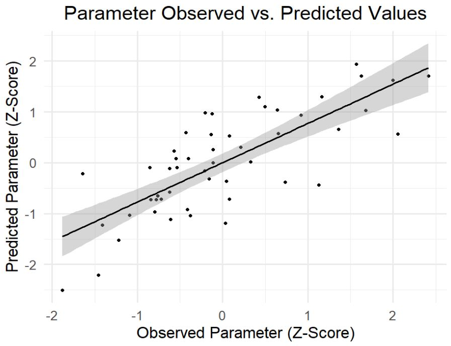

**R Function Name:**  
# EN_Test
Function that validates features chosen via elastic net modeling by identifying out-of-sample prediction ability.

**Overview:**  
Elastic net is a form of penalized linear regression that performs feature selection by shrinking beta coefficients of predictor variables using a penalty term, 
the stength of which is determined using a hyperperamater lambda, with a smaller lambda selecting more predictor terms, and larger selecting fewer. A range of values are used for lambda,
and ultimately the model using the lambda value and selected features that produces the lowest mean squared error (MSE) are found. In this way, Elastic Net can be used to identify important 
features, for example gene expression levels, implicated in clinical parameters (age, bmi, etc.).

One downside of elastic net modeling using common R functions such as cv.glmnet is the variability of the output, as train and test sets are selected randomly. This function, in coordination with the EN_Repeat function reduces variability and increases the robustness of results by repeating elastic net modeling in R using the glmnet package a user-specified number of times, averages the output, and produces a lambda value and set of selected features that produce the lowest MSE across many trials. The EN_Repeat function auto-scales features, uses parallel processing for faster output, and automates useful visualizations of the selected features. Using this output, EN_Test validates the optimized lambda and selected features chosen using 80% of the provided dataset by examining their out-of-sample prediction ability on the remaining 20% of the provided dataset. 

**Usage:**  
EN_Repeat_Results <- EN_Test(clin_df, protein_list, control_list, trait_list, alpha, iterations, trait1=FALSE, label1=NA, heatmap = FALSE)

**Arguments**  
| Parameter      | Type        | Description                                                                                             |
|----------------|-------------|---------------------------------------------------------------------------------------------------------|
| `clin_df `     | `dataframe` | Table of microarray data containing gene expression values and covariates by columns, sample IDs by row |
| `protein_list` | `vector `   | Vector of genes from which to perform feature selection, and any continuous covariates                  |
| `control_list` | `vector `   | Vector of categorical covariates                                                                        |
| `trait_list`   | `vector `   | Vector of continuous traits for which to select implicated features                                     |
| `alpha`        | `numeric `  | Number indicating hyperparameter alpha (0 for ridge, 1 for lasso, in-between for Elastic Net)           |
| `interations`  | `numeric `  | Number indicating the number of times the analysis will be run                                          |
| `trait1`       | `string`    | If supplied, individual parameter examined and scatterplot (oberved vs. predicted values) produced.     |
| `label1`       | `string `   | If supplied, a label used for the individual parameter graph label.                                     |
| `heatmap`      | `boolean `  | Boolean value determining if a heatmap displaying effect size by feature and trait will be returned     |

**Return Values:**  
- cor_table is a table showing the correlation between the observed and predicted values for the test set for each suppled parameter, along with p-value, with false dicovery rate correction.

| Trait      | Cor        | Pval       | fdr        | method      |
|------------|------------|------------|------------|-------------|
| Parameter 1 | 0.46       | 0.0003     | 0.0041     | Elastic Net |
| Parameter 2 | 0.39       | 0.0039     | 0.0099     | Elastic Net |
| Parameter 3 | 0.33       | 0.014      | 0.0123     | Elastic Net |
| Parameter 4 | 0.21       | 0.067      | 0.0910     | Elastic Net |

- scatter is a scatterplot for a single selected parameter, if supplied, showing the observed and predicted values for the test set of this parameter. 

  

**Dependencies:**  
glmnet  
ggplot2  
heatmaply  
doParallel

**Notes**  
This function will produce an error if the heatmap functionality is set to true and any of the parameters have 0 selected features. If this error occurs, set heatmap to false, or turn off denogram clustering for the heatmaply function in EN_Repeat. 

**Author**  
Bradley Olinger, PhD  
b.a.olinger@gmail.com

